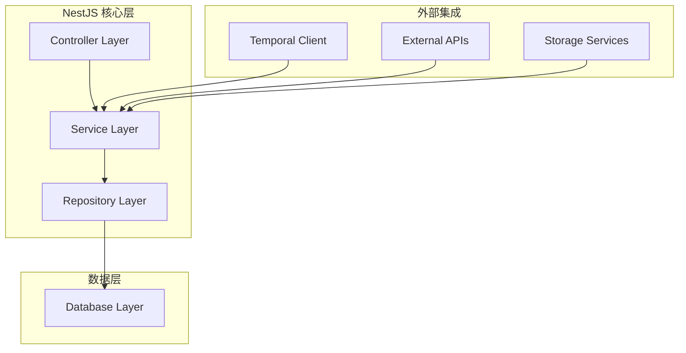

# NestJS 架构设计

基于 NestJS 框架的后端服务架构，采用模块化设计、依赖注入和装饰器模式。

## 概述

Rematrix Server 使用 NestJS 11 作为核心框架，构建了一个可扩展、可维护的视频生成后端服务。NestJS 提供了强大的模块系统、依赖注入容器和装饰器生态。

## 架构层次



---

## 模块结构

### 应用根模块

```typescript
// src/app.module.ts
@Module({
  imports: [
    // 核心模块
    ConfigModule.forRoot({
      isGlobal: true,
      validationSchema: Joi.object({
        DATABASE_URL: Joi.string().required(),
        OPENROUTER_API_KEY: Joi.string().required(),
        TEMPORAL_ADDRESS: Joi.string().default('localhost:7233'),
      }),
    }),
    
    // 数据库模块
    PrismaModule,
    
    // 业务模块
    JobsModule,
    ArtifactsModule,
    WorkflowEngineModule,
    ChatMessagesModule,
    StorageModule,
    TemporalModule,
    PromptOpsModule,
    
    // 工作流模块
    WorkflowEngineModule,
    WorkflowStepsModule,
  ],
  controllers: [AppController],
  providers: [AppService],
})
export class AppModule {}
```

### 核心业务模块

#### 1. Jobs 模块

```typescript
// src/modules/jobs/jobs.module.ts
@Module({
  imports: [
    // 依赖模块
    ChatMessagesModule,
    WorkflowEngineModule,
    PrismaModule,
  ],
  controllers: [JobsController],
  providers: [JobsService],
  exports: [JobsService],
})
export class JobsModule {}
```

**职责**:
- 任务生命周期管理
- 工作流启动和控制
- 审批流程协调
- 状态转换处理

#### 2. Artifacts 模块

```typescript
// src/modules/artifacts/artifacts.module.ts
@Module({
  imports: [PrismaModule, StorageModule],
  controllers: [ArtifactsController],
  providers: [ArtifactsService],
  exports: [ArtifactsService],
})
export class ArtifactsModule {}
```

**职责**:
- 产物存储和检索
- 内容格式化
- 对象存储集成
- 缓存管理

#### 3. Workflow Engine 模块

```typescript
// src/modules/workflow-engine/workflow-engine.module.ts
@Module({
  imports: [JobsModule, PrismaModule],
  controllers: [WorkflowEngineController],
  providers: [WorkflowEngineService],
  exports: [WorkflowEngineService],
})
export class WorkflowEngineModule {}
```

**职责**:
- 指令解析和执行
- 自然语言处理
- 工作流状态管理
- 历史记录维护

---

## 设计模式应用

### 1. 依赖注入 (Dependency Injection)

```typescript
// 服务层依赖注入
@Injectable()
export class JobsService {
  constructor(
    private readonly prisma: PrismaService,
    private readonly temporalClient: TemporalClient,
    private readonly artifacts: ArtifactsService,
    private readonly chatMessages: ChatMessagesService,
    private readonly workflowEngine: WorkflowEngineService,
  ) {}
  
  async create(dto: CreateJobDto): Promise<Job> {
    // 使用注入的服务
    const job = await this.prisma.job.create({
      data: {
        status: 'PENDING',
        currentStage: 'PLAN',
        config: dto.config,
      },
    });
    
    return job;
  }
}
```

**优势**:
- 松耦合设计
- 易于测试和模拟
- 配置灵活
- 生命周期管理

### 2. 装饰器模式 (Decorator Pattern)

```typescript
// 控制器装饰器
@Controller('jobs')
@ApiTags('Jobs')
export class JobsController {
  constructor(
    private readonly jobs: JobsService,
    private readonly workflowEngine: WorkflowEngineService,
  ) {}

  @Post()
  @ApiOperation({ summary: '创建新任务' })
  @ApiResponse({ status: 201, description: '任务创建成功' })
  async create(@Body() dto: CreateJobDto) {
    const job = await this.jobs.create(dto);
    return { jobId: job.id };
  }

  @Get(':id')
  @Param('id', ParseUUIDPipe)
  async get(@Param('id') id: string) {
    return this.jobs.get(id);
  }
}
```

**装饰器类型**:
- `@Controller()`: 路由控制器
- `@Get()`, `@Post()`: HTTP 方法
- `@Param()`, `@Body()`, `@Query()`: 参数解析
- `@Injectable()`: 服务注册
- `@UseGuards()`: 路由守卫
- `@UseInterceptors()`: 拦截器

### 3. 策略模式 (Strategy Pattern)

```typescript
// 存储策略
interface StorageStrategy {
  upload(data: UploadData): Promise<UploadResult>;
  download(key: string): Promise<Buffer>;
  delete(key: string): Promise<void>;
}

@Injectable()
export class BunnyStorageStrategy implements StorageStrategy {
  async upload(data: UploadData): Promise<UploadResult> {
    // Bunny Storage 实现
  }
}

@Injectable()
export class LocalStorageStrategy implements StorageStrategy {
  async upload(data: UploadData): Promise<UploadResult> {
    // 本地存储实现
  }
}

@Injectable()
export class StorageService {
  constructor(
    @Inject('STORAGE_STRATEGY') private strategy: StorageStrategy,
  ) {}
  
  async upload(data: UploadData) {
    return this.strategy.upload(data);
  }
}
```

---

## 中间件和拦截器

### 1. 全局中间件

```typescript
// src/middleware/logging.middleware.ts
@Injectable()
export class LoggingMiddleware implements NestMiddleware {
  use(req: Request, res: Response, next: NextFunction) {
    const { method, url, ip } = req;
    const userAgent = req.get('User-Agent') || '';
    
    console.log(`${method} ${url} - ${ip} - ${userAgent}`);
    
    const start = Date.now();
    res.on('finish', () => {
      const duration = Date.now() - start;
      console.log(`${method} ${url} - ${res.statusCode} - ${duration}ms`);
    });
    
    next();
  }
}

// 应用中间件
app.use((req, res, next) => {
  // CORS 处理
  res.header('Access-Control-Allow-Origin', '*');
  res.header('Access-Control-Allow-Methods', 'GET,PUT,POST,DELETE,OPTIONS');
  res.header('Access-Control-Allow-Headers', 'Content-Type, Authorization');
  
  if (req.method === 'OPTIONS') {
    res.sendStatus(200);
  } else {
    next();
  }
});
```

### 2. 响应拦截器

```typescript
// src/interceptors/response.interceptor.ts
@Injectable()
export class ResponseInterceptor<T> implements NestInterceptor<T, any> {
  intercept(context: ExecutionContext, next: CallHandler): Observable<any> {
    const request = context.switchToHttp().getRequest();
    const { method, url } = request;
    
    return next.handle().pipe(
      map(data => ({
        success: true,
        data,
        timestamp: new Date().toISOString(),
        path: url,
        method,
      })),
      catchError(error => {
        console.error(`Error in ${method} ${url}:`, error);
        
        return throwError(() => ({
          success: false,
          error: {
            code: error.code || 'INTERNAL_ERROR',
            message: error.message || 'Internal server error',
            timestamp: new Date().toISOString(),
            path: url,
            method,
          },
        }));
      }),
    );
  }
}
```

---

## 异常处理

### 全局异常过滤器

```typescript
// src/exceptions/http.exception.filter.ts
@Catch()
export class AllExceptionsFilter implements ExceptionFilter {
  private readonly logger = new Logger(AllExceptionsFilter.name);

  catch(exception: unknown, host: ArgumentsHost) {
    const ctx = host.switchToHttp();
    const response = ctx.getResponse<Response>();
    const request = ctx.getRequest<Request>();

    let status: number;
    let message: string;
    let code: string;

    if (exception instanceof HttpException) {
      status = exception.getStatus();
      const exceptionResponse = exception.getResponse();
      
      if (typeof exceptionResponse === 'string') {
        message = exceptionResponse;
      } else if (typeof exceptionResponse === 'object') {
        message = (exceptionResponse as any).message || exception.message;
        code = (exceptionResponse as any).code;
      }
    } else if (exception instanceof PrismaClientKnownRequestError) {
      // Prisma 错误处理
      status = 400;
      message = this.handlePrismaError(exception);
      code = 'DATABASE_ERROR';
    } else {
      status = 500;
      message = 'Internal server error';
      code = 'INTERNAL_ERROR';
      
      this.logger.error(
        `${request.method} ${request.url}`,
        exception instanceof Error ? exception.stack : exception,
      );
    }

    const errorResponse = {
      success: false,
      error: {
        code,
        message,
        timestamp: new Date().toISOString(),
        path: request.url,
        method: request.method,
      },
    };

    response.status(status).json(errorResponse);
  }

  private handlePrismaError(error: PrismaClientKnownRequestError): string {
    switch (error.code) {
      case 'P2002':
        return '资源已存在';
      case 'P2025':
        return '资源不存在';
      case 'P2003':
        return '外键约束失败';
      default:
        return '数据库操作失败';
    }
  }
}
```

---

## 数据验证

### DTO 验证

```typescript
// src/modules/jobs/dto/create-job.dto.ts
export class CreateJobDto {
  @ApiProperty({
    description: '任务配置',
    example: {
      markdown: '# 示例文档\n\n这是一个测试文档。',
    },
  })
  @IsObject()
  @IsNotEmpty()
  @ValidateNested()
  config: JobConfigDto;
}

export class JobConfigDto {
  @ApiProperty({
    description: 'Markdown 内容',
    example: '# 标题\n\n内容...',
  })
  @IsString()
  @IsNotEmpty()
  @MaxLength(100000) // 限制最大长度
  markdown: string;
}

// 审批 DTO
export class ApproveJobDto {
  @ApiProperty({
    description: '审批阶段',
    enum: ['PLAN', 'NARRATION', 'PAGES'],
    example: 'PLAN',
  })
  @IsEnum(['PLAN', 'NARRATION', 'PAGES'])
  @IsNotEmpty()
  stage: string;

  @ApiProperty({
    description: '审批意见',
    required: false,
    example: '计划看起来不错，继续执行',
  })
  @IsString()
  @IsOptional()
  @MaxLength(1000)
  comment?: string;
}
```

### 管道验证

```typescript
// 自定义验证管道
@Injectable()
export class ValidationPipe implements PipeTransform {
  async transform(value: any, { metatype }: ArgumentMetadata) {
    if (!metatype || !this.toValidate(metatype)) {
      return value;
    }

    const object = plainToClass(metatype, value);
    const errors = await validate(object);

    if (errors.length > 0) {
      const errorMessages = errors.map(error => {
        const constraints = error.constraints;
        return constraints ? Object.values(constraints).join(', ') : '验证失败';
      });
      
      throw new BadRequestException(errorMessages.join('; '));
    }

    return object;
  }

  private toValidate(metatype: Function): boolean {
    const types: Function[] = [String, Boolean, Number, Array, Object];
    return !types.includes(metatype);
  }
}
```

---

## 配置管理

### 环境配置

```typescript
// src/config/configuration.ts
export default () => ({
  port: parseInt(process.env.PORT, 10) || 3000,
  
  database: {
    url: process.env.DATABASE_URL,
  },
  
  temporal: {
    address: process.env.TEMPORAL_ADDRESS || 'localhost:7233',
    namespace: process.env.TEMPORAL_NAMESPACE || 'default',
    taskQueue: process.env.TEMPORAL_TASK_QUEUE || 'rematrix-video',
  },
  
  ai: {
    openrouterApiKey: process.env.OPENROUTER_API_KEY,
    model: process.env.AI_MODEL || 'google/gemini-3-flash-preview',
    temperature: parseFloat(process.env.AI_TEMPERATURE) || 0.2,
  },
  
  storage: {
    bunny: {
      zone: process.env.BUNNY_STORAGE_ZONE,
      hostname: process.env.BUNNY_STORAGE_HOSTNAME,
      accessKey: process.env.BUNNY_STORAGE_ACCESS_KEY,
      publicBaseUrl: process.env.BUNNY_PUBLIC_BASE_URL,
    },
  },
});
```

### 配置验证

```typescript
// src/config/validation.schema.ts
import * as Joi from 'joi';

export const validationSchema = Joi.object({
  NODE_ENV: Joi.string().valid('development', 'production', 'test').default('development'),
  PORT: Joi.number().default(3000),
  
  DATABASE_URL: Joi.string().required(),
  
  TEMPORAL_ADDRESS: Joi.string().default('localhost:7233'),
  TEMPORAL_NAMESPACE: Joi.string().default('default'),
  TEMPORAL_TASK_QUEUE: Joi.string().default('rematrix-video'),
  
  OPENROUTER_API_KEY: Joi.string().required(),
  AI_MODEL: Joi.string().default('google/gemini-3-flash-preview'),
  AI_TEMPERATURE: Joi.number().min(0).max(2).default(0.2),
  
  BUNNY_STORAGE_ZONE: Joi.string().optional(),
  BUNNY_STORAGE_HOSTNAME: Joi.string().optional(),
  BUNNY_STORAGE_ACCESS_KEY: Joi.string().optional(),
  BUNNY_PUBLIC_BASE_URL: Joi.string().optional(),
});
```

---

## 测试架构

### 单元测试

```typescript
// src/modules/jobs/jobs.service.spec.ts
describe('JobsService', () => {
  let service: JobsService;
  let prisma: PrismaService;
  let temporalClient: TemporalClient;

  beforeEach(async () => {
    const module: TestingModule = await Test.createTestingModule({
      providers: [
        JobsService,
        {
          provide: PrismaService,
          useValue: {
            job: {
              create: jest.fn(),
              findUnique: jest.fn(),
              update: jest.fn(),
            },
          },
        },
        {
          provide: TemporalClient,
          useValue: {
            startWorkflow: jest.fn(),
            signalWorkflow: jest.fn(),
          },
        },
      ],
    }).compile();

    service = module.get<JobsService>(JobsService);
    prisma = module.get<PrismaService>(PrismaService);
    temporalClient = module.get<TemporalClient>(TemporalClient);
  });

  describe('create', () => {
    it('should create a job successfully', async () => {
      const createJobDto: CreateJobDto = {
        config: {
          markdown: '# Test Document',
        },
      };

      const expectedJob = {
        id: 'job-123',
        status: 'PENDING',
        currentStage: 'PLAN',
        config: createJobDto.config,
        createdAt: new Date(),
        updatedAt: new Date(),
      };

      jest.spyOn(prisma.job, 'create').mockResolvedValue(expectedJob);

      const result = await service.create(createJobDto);

      expect(result).toEqual(expectedJob);
      expect(prisma.job.create).toHaveBeenCalledWith({
        data: {
          status: 'PENDING',
          currentStage: 'PLAN',
          config: createJobDto.config,
        },
      });
    });
  });
});
```

### 集成测试

```typescript
// test/jobs.e2e-spec.ts
describe('Jobs API (e2e)', () => {
  let app: INestApplication;

  beforeEach(async () => {
    const moduleFixture: TestingModule = await Test.createTestingModule({
      imports: [AppModule],
    }).compile();

    app = moduleFixture.createNestApplication();
    await app.init();
  });

  describe('/jobs (POST)', () => {
    it('should create a job', () => {
      return request(app.getHttpServer())
        .post('/jobs')
        .send({
          config: {
            markdown: '# Test Document\n\nThis is a test.',
          },
        })
        .expect(201)
        .expect((res) => {
          expect(res.body).toHaveProperty('jobId');
          expect(typeof res.body.jobId).toBe('string');
        });
    });
  });

  describe('/jobs/:id (GET)', () => {
    it('should return job details', async () => {
      // 先创建一个任务
      const createResponse = await request(app.getHttpServer())
        .post('/jobs')
        .send({
          config: {
            markdown: '# Test Document',
          },
        });

      const { jobId } = createResponse.body;

      // 查询任务详情
      return request(app.getHttpServer())
        .get(`/jobs/${jobId}`)
        .expect(200)
        .expect((res) => {
          expect(res.body).toHaveProperty('id', jobId);
          expect(res.body).toHaveProperty('status', 'PENDING');
          expect(res.body).toHaveProperty('currentStage', 'PLAN');
        });
    });
  });
});
```

---

## 性能优化

### 1. 缓存策略

```typescript
// 缓存服务
@Injectable()
export class CacheService {
  private cache = new Map<string, { data: any; expiry: number }>();

  set(key: string, data: any, ttl: number = 300000) { // 5分钟默认
    const expiry = Date.now() + ttl;
    this.cache.set(key, { data, expiry });
  }

  get(key: string): any | null {
    const item = this.cache.get(key);
    
    if (!item) return null;
    
    if (Date.now() > item.expiry) {
      this.cache.delete(key);
      return null;
    }
    
    return item.data;
  }

  clear() {
    this.cache.clear();
  }
}

// 在服务中使用缓存
@Injectable()
export class JobsService {
  constructor(
    private readonly cache: CacheService,
    // ... 其他依赖
  ) {}

  async get(id: string) {
    const cacheKey = `job:${id}`;
    let job = this.cache.get(cacheKey);
    
    if (!job) {
      job = await this.prisma.job.findUnique({
        where: { id },
        include: { artifacts: true },
      });
      
      if (job) {
        this.cache.set(cacheKey, job, 60000); // 缓存1分钟
      }
    }
    
    return job;
  }
}
```

### 2. 数据库优化

```typescript
// 数据库连接池配置
@Injectable()
export class PrismaService extends PrismaClient {
  async onModuleInit() {
    await this.$connect();
  }

  async onModuleDestroy() {
    await this.$disconnect();
  }
}

// 批量操作优化
async createArtifactsBatch(artifacts: CreateArtifactDto[]) {
  return this.prisma.artifact.createMany({
    data: artifacts,
    skipDuplicates: true,
  });
}

// 查询优化
async getJobsWithArtifacts(jobIds: string[]) {
  return this.prisma.job.findMany({
    where: {
      id: { in: jobIds },
    },
    include: {
      artifacts: {
        select: {
          id: true,
          stage: true,
          type: true,
          createdAt: true,
          // 不包含大字段 content
        },
      },
    },
  });
}
```

---

## 监控和日志

### 结构化日志

```typescript
// 日志服务
@Injectable()
export class LoggerService extends Logger {
  logWithContext(context: string, message: string, meta?: any) {
    const logData = {
      timestamp: new Date().toISOString(),
      context,
      message,
      ...meta,
    };
    
    super.log(message, context);
    
    // 发送到日志聚合系统
    if (process.env.NODE_ENV === 'production') {
      this.sendToLogAggregator(logData);
    }
  }

  private sendToLogAggregator(logData: any) {
    // 实现日志聚合
  }
}

// 在服务中使用
@Injectable()
export class JobsService {
  private readonly logger = new LoggerService(JobsService.name);

  async create(dto: CreateJobDto) {
    this.logger.logWithContext('create', 'Creating new job', {
      markdownLength: dto.config.markdown.length,
    });
    
    // ... 业务逻辑
  }
}
```

---

## 总结

NestJS 架构为 Rematrix Server 提供了：

1. **模块化设计**: 清晰的职责分离和代码组织
2. **依赖注入**: 松耦合和易测试性
3. **装饰器生态**: 声明式编程和元数据驱动
4. **类型安全**: TypeScript 的完整支持
5. **可扩展性**: 插件系统和中间件支持
6. **企业级特性**: 验证、缓存、监控等

这种架构设计确保了系统的可维护性、可测试性和可扩展性，为复杂的视频生成业务提供了坚实的技术基础。

---

*相关文档*: [Temporal 工作流](./temporal.md) | [数据库设计](./database.md) | [API 接口](../api/)
